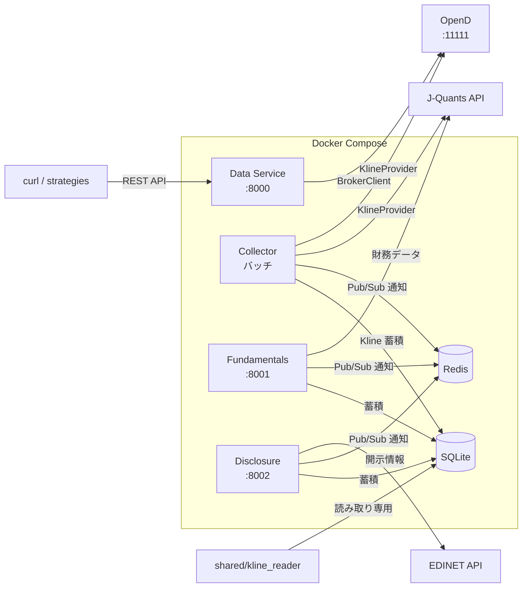

# moomoo-trader

マルチデータソース対応の株式トレーディングツール。moomoo OpenAPI、J-Quants API、EDINET API を統合し、相場データ取得・注文発注・ポートフォリオ管理・財務データ・開示情報をカバーする。

## アーキテクチャ



## 前提条件

- Docker / Docker Compose
- moomoo 証券口座 + [OpenD](https://openapi.moomoo.com/moomoo-api-doc/en/) がローカルで起動
- 利用するデータソースに応じた API キー:
  - **J-Quants**: API キー（collector / fundamentals で使用）
  - **EDINET**: API キー（disclosure で使用）

## セットアップ

### 1. 環境変数の設定

```bash
cp .env.example .env
# .env を編集して必要な値を設定
```

### 2. サービスの起動

```bash
# 全サービス起動
docker compose up -d

# 個別起動（例: data + collector のみ）
docker compose up -d data collector

# ヘルスチェック
curl http://localhost:8000/health   # Data
curl http://localhost:8001/health   # Fundamentals
curl http://localhost:8002/health   # Disclosure
```

## 環境変数一覧

### 共通

| 変数 | 必須 | 説明 |
|------|------|------|
| `API_SECRET` | Yes | 全サービス共通の Bearer 認証トークン |

### Data Service

| 変数 | 必須 | デフォルト | 説明 |
|------|------|-----------|------|
| `OPEND_HOST` | No | `host.docker.internal` | OpenD ホスト |
| `OPEND_PORT` | No | `11111` | OpenD ポート |
| `TRADE_ENV` | No | `SIMULATE` | 取引環境 (`SIMULATE` / `REAL`) |
| `TRADE_PASSWORD` | REAL時 | - | 本番環境アンロック用パスワード |

### Collector Service

| 変数 | 必須 | デフォルト | 説明 |
|------|------|-----------|------|
| `OPEND_HOST` | No | `host.docker.internal` | OpenD ホスト |
| `OPEND_PORT` | No | `11111` | OpenD ポート |
| `REDIS_HOST` | No | `redis` | Redis ホスト |
| `REDIS_PORT` | No | `6379` | Redis ポート |
| `DB_PATH` | No | `/data/klines.db` | SQLite パス |
| `LOOP_INTERVAL` | No | `30` | メインループ間隔（秒） |
| `JQUANTS_API_KEY` | J-Quants時 | - | J-Quants API キー |

### Fundamentals Service

| 変数 | 必須 | デフォルト | 説明 |
|------|------|-----------|------|
| `JQUANTS_API_KEY` | Yes | - | J-Quants API キー |
| `WATCHLIST_CODES` | Yes | - | 収集対象銘柄コード（カンマ区切り） |
| `REDIS_HOST` | No | `redis` | Redis ホスト |
| `REDIS_PORT` | No | `6379` | Redis ポート |
| `DB_PATH` | No | `/data/fundamentals.db` | SQLite パス |
| `LOOP_INTERVAL` | No | `21600` | 収集間隔（秒、デフォルト 6 時間） |

### Disclosure Service

| 変数 | 必須 | デフォルト | 説明 |
|------|------|-----------|------|
| `EDINET_API_KEY` | Yes | - | EDINET API キー |
| `REDIS_HOST` | No | `redis` | Redis ホスト |
| `REDIS_PORT` | No | `6379` | Redis ポート |
| `DB_PATH` | No | `/data/disclosure.db` | SQLite パス |
| `LOOP_INTERVAL` | No | `21600` | 収集間隔（秒、デフォルト 6 時間） |

## ディレクトリ構成

```
moomoo-trader/
├── src/                         # 共通ライブラリ（services/ と strategies/ が共用）
│   ├── client.py               # MoomooClient (コンテキストマネージャ対応)
│   ├── market_data.py          # 株価・Kline・板情報
│   ├── order.py                # 発注・キャンセル
│   ├── portfolio.py            # ポジション・口座・注文一覧・約定
│   └── broker/                 # ブローカー抽象化 (Protocol ベース)
│       ├── base.py             # BrokerClient Protocol + dataclass
│       ├── moomoo_broker.py    # moomoo OpenD 実装
│       └── factory.py          # create_broker() ファクトリ
├── services/
│   ├── data/                   # Data Service (:8000) - 照会系 REST API
│   ├── collector/              # Collector Service - Kline 定期収集
│   ├── fundamentals/           # Fundamentals Service (:8001) - 財務データ
│   └── disclosure/             # Disclosure Service (:8002) - 開示情報
├── shared/                     # 全サービス共通ユーティリティ
│   ├── kline_reader.py         # SQLite Kline 読み取り（読み取り専用）
│   ├── utils.py                # df_to_records 等
│   ├── http_client.py          # httpx + リトライ
│   └── auth/
│       └── token_manager.py    # J-Quants API Key 認証
├── strategies/                 # トレーディング戦略
├── scripts/                    # ユーティリティスクリプト
├── docker-compose.yml
└── .env.example
```

## サービス詳細

各サービスの詳細は個別の README を参照:

- [Data Service](services/data/README.md) - 相場データ・ポートフォリオ照会 REST API
- [Collector Service](services/collector/README.md) - Kline 定期収集バッチ
- [Fundamentals Service](services/fundamentals/README.md) - J-Quants 財務データ
- [Disclosure Service](services/disclosure/README.md) - EDINET 開示情報

## データ参照方式

| 方式 | データソース | 用途 | 提供元 |
|------|-------------|------|--------|
| **ライブ参照** | OpenD | リアルタイム株価・板情報・注文状態 | Data Service (BrokerClient 経由) |
| **蓄積参照** | SQLite (collector 経由) | 過去 Kline・テクニカル指標・バックテスト | shared/kline_reader.py |
| **財務参照** | SQLite (fundamentals 経由) | 財務諸表・銘柄情報・決算発表予定 | Fundamentals Service |
| **開示参照** | SQLite (disclosure 経由) | 有報・大量保有報告書 | Disclosure Service |

## 市場制約

- **HK 市場**: moomoo 検証に使用（HK.00700 等）
- **JP 市場**: J-Quants, EDINET で使用
- **US 市場**: 権限なし（現在使用不可）

## 注意事項

- `TRADE_ENV=SIMULATE` がデフォルト。本番切替は慎重に
- `.env` には認証情報が含まれるため絶対にコミットしない
- 各サービスはシークレット未設定時に起動を拒否する（fail-closed）
